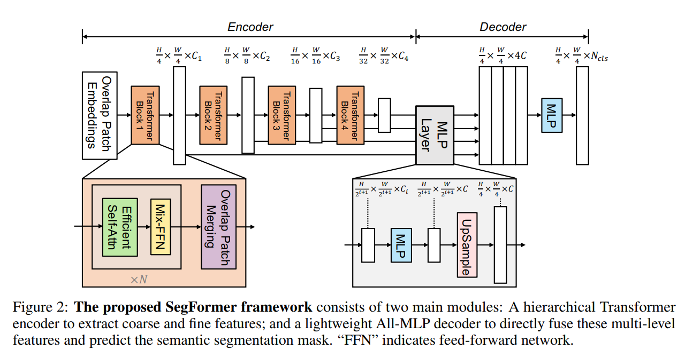
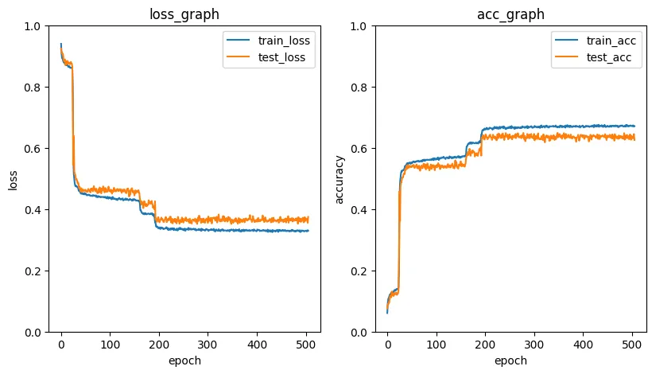

# H&E patch level Segmentation

담당자: 영섭 이
진행 상태: 진행 중
마감일: 2025년 9월 12일
프로젝트: H&E 조직 영역 분할 (https://www.notion.so/H-E-26942971c02f8070ab75fe90098a46e8?pvs=21)
git repositories: https://github.com/Leeyoungsup/HnE_Organizational_Segmentation

## Data Set

- IGINTE 오픈 데이터셋 사용
[https://zenodo.org/records/15674785](https://zenodo.org/records/15674785)

```
@misc{spronck2025tissuecelllevelannotatedhe,
      title={A tissue and cell-level annotated H&E and PD-L1 histopathology image dataset in non-small cell lung cancer},
      author={Joey Spronck and Leander van Eekelen and Dominique van Midden and Joep Bogaerts and Leslie Tessier and Valerie Dechering and Muradije Demirel-Andishmand and Gabriel Silva de Souza and Roland Nemeth and Enrico Munari and Giuseppe Bogina and Ilaria Girolami and Albino Eccher and Balazs Acs and Ceren Boyaci and Natalie Klubickova and Monika Looijen-Salamon and Shoko Vos and Francesco Ciompi},
      year={2025},
      eprint={2507.16855},
      archivePrefix={arXiv},
      primaryClass={q-bio.QM},
      url={https://arxiv.org/abs/2507.16855},
}
```

- 패치 데이터 레벨 영역 분할 사용

```
{
    "Unannotated": 0,
    "Background": 1,
    "Tumor epithelium": 2,
    "Reactive epithelium": 3,
    "Stroma": 4,
    "Inflammation": 5,
    "Alveolar tissue": 6,
    "Fatty tissue": 7,
    "Necrotic tissue": 8,
    "Erythrocytes": 9,
    "Bronchial epithelium": 10,
    "Mucus/Plasma/Fluids": 11,
    "Cartilage/Bone": 12,
    "Macrophages": 13,
    "Muscle": 14,
    "Liver": 15,
    "Keratinization": 16
}
```

- 데이터 수량
- 크기가 상이한 이미지 408건
- Annotation 이미지 408건
- Train : Validation : Test = 8 : 1 : 1


# AI

- **Transformer** 기반의 semantic segmentation 모델인 **SegFormer 사용**
- **Hierarchical Transformer Encoder**
    - 기존 **ViT**: 이미지를 패치로 잘라 flatten → 공간 정보 손실 발생
    - SegFormer 개선점:
        - **다단계 feature map 생성** (CNN처럼 low → high resolution 계층적 특징맵)
        - **Overlapping Patch Embedding** → 패치 간 연속성·맥락 보존
        - **Efficient Self-Attention** → 해상도에 직접 비례하지 않고 feature 크기에 맞춰 연산 최적화
- **Lightweight MLP Decoder**
    - 기존 segmentation 모델(DeepLabV3, PSPNet 등)은 복잡한 decoder 사용 → 무거움
    - SegFormer는 **단순 MLP 기반 decoder**:
        - Encoder의 multi-scale feature를 **Upsample 후 concat**
        - 각 feature를 MLP projection → 최종 feature 합성
        - 최종적으로 segmentation mask 출력
- **장점**
    - 구조 단순 + 추론 속도 빠름
    - 높은 정확도 (SOTA 수준)
    - 다양한 입력 해상도에서 유연하게 적용 가능



## Training



